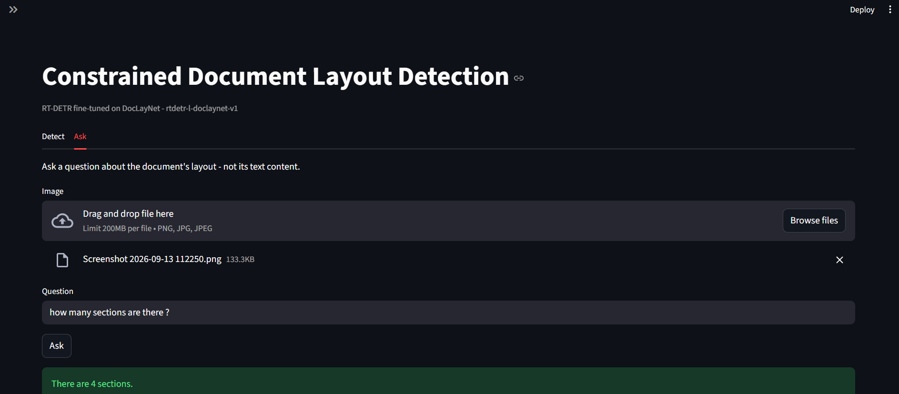
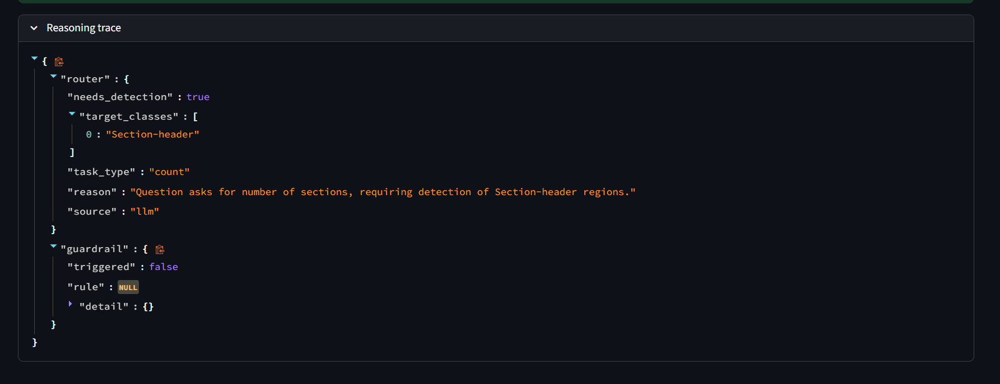
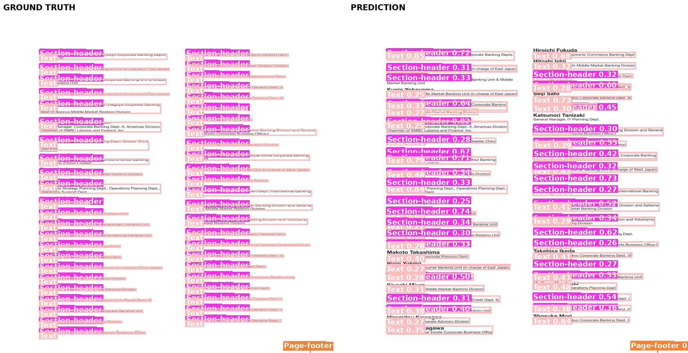
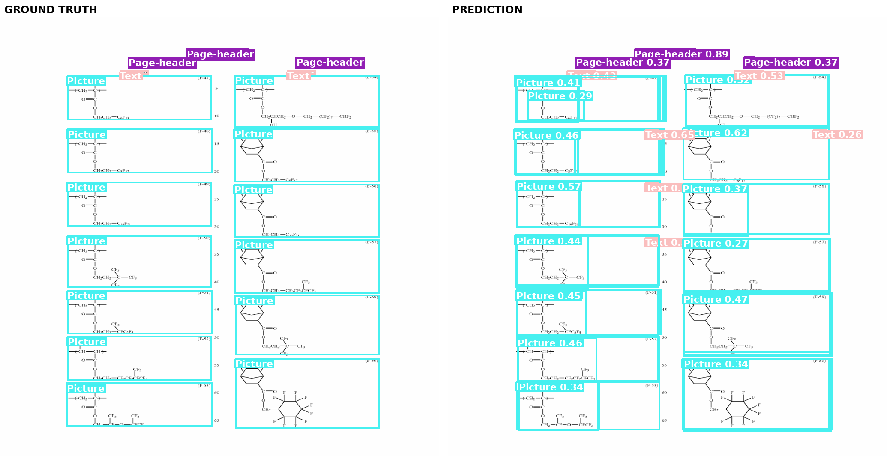
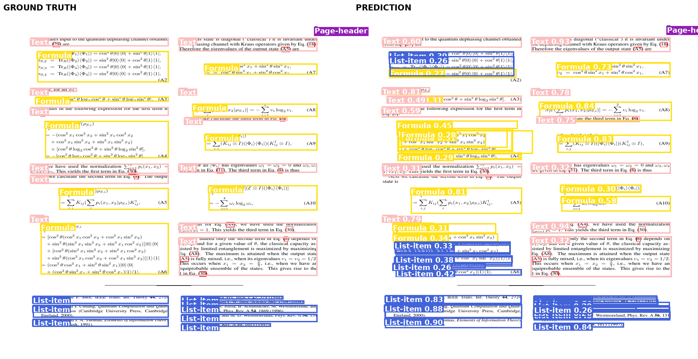

# Constrained Document Layout Detection & Reasoning API

RT-DETR fine-tuned on DocLayNet for document layout detection, plus a
hand-written natural-language reasoning layer that knows the difference
between what it can see and what it can't.

Built for RAP's Pre-Hackathon Screening (Track: CV + Applied ML Engineering).

## 🚀 **[Try it live — huggingface.co/spaces/RISHIVEL/RAP_DocLayout_DetectionD](https://huggingface.co/spaces/RISHIVEL/RAP_DocLayout_DetectionD)**

No setup needed — upload a document page and see real detections and
Q&A running against the actual trained model.

> **Model weights (`best.pt`, 66 MB) are not in this repo — too large for
> git.** **[⬇ Download here](https://github.com/RISHIVELS/doc_layout_detection/releases/download/weights-v1/best.pt)**
> and place at `weights/best.pt` before running anything below.


## What this is

Given a document page image, the model detects and classifies structural
regions — tables, headings, captions, formulas, footnotes — none of which
exist in COCO's class vocabulary. A second endpoint answers natural-language
questions about the page's **layout**, routing correctly between "this
needs detection," "this doesn't," and "I can't answer that confidently."

**Domain rationale, full dataset justification, evaluation methodology, and
five root-caused failure cases:** see [`memo/MEMO.md`](memo/MEMO.md).
**Full build log, including every real infrastructure failure hit along the
way and how each was diagnosed:** see [`memo/BUILD_LOG.md`](memo/BUILD_LOG.md).

## Demo

**Ask tab** — routes a layout question to the detector, answers from
structured evidence:



Every answer comes with a reasoning trace — the router's decision and the
guardrail's verdict, both auditable:



## Results

Trained RT-DETR-L for 15 epochs on a Tesla T4 (2.27h), evaluated on the
499-image held-out test split.

| Metric | Value |
|---|---|
| mAP50 | **0.622** |
| mAP50-95 | **0.412** |
| Precision | 0.706 |
| Recall | 0.605 |
| Inference speed | 41.3 ms/image (T4) |

**Per-class mAP50:**

| Class | mAP50 | Class | mAP50 |
|---|---|---|---|
| Page-footer | 0.843 | List-item | 0.671 |
| Text | 0.832 | Page-header | 0.658 |
| Formula | 0.788 | Picture | 0.495 |
| Section-header | 0.762 | Title | 0.224 |
| Table | 0.761 | Footnote | 0.182 |
| Caption | 0.622 | | |

`Footnote` and `Title` are the weakest classes — both rare (47 and 52
instances) rather than simply small. `Page-footer` is nearly as thin as
`Footnote` but has 8x more training instances and a highly consistent
position, and it's one of the *best*-performing classes. Full root-cause
analysis in the memo — three of the five cases are backed by actual
rendered GT-vs-prediction images, not just numbers (ground truth on the
left, prediction on the right):



Dense repeated-entry layouts (here, a bank's organizational directory)
produce duplicate, overlapping boxes instead of one per entry — worst
page in the run (38 missed, 82 false positives).



A composite `Picture` (a chemical diagram) gets split into 2–3 overlapping
boxes instead of one — explains `Picture`'s low precision (0.416) despite
reasonable recall (0.622).



The same duplicate-box failure recurs on a scientific article's reference
list and on individual formula blocks — confirms it's a general
limitation of the fixed-query architecture, not a one-off quirk of the
financial-report case above.

(Full set of 25 mined failure renders: `reports/failures/` — gitignored
as a large batch; these three are tracked separately in
`reports/failure_examples/` as the cited evidence.)

**Per-document-category mAP50** (does the model generalize, or did it just
learn financial reports?):

| Category | Pages | mAP50 |
|---|---|---|
| scientific_articles | 103 | 0.745 |
| patents | 32 | 0.743 |
| manuals | 77 | 0.633 |
| government_tenders | 29 | 0.547 |
| financial_reports | 172 | 0.535 |
| laws_and_regulations | 86 | 0.495 |

**Sanity checks measured, not assumed:** 0% of test pages saturated RT-DETR's
300-query budget (max regions on any page: 95); 0% of test pages share a
source PDF with the training set.

**[Visual evaluation report (PDF)](reports/evaluation_report.pdf)** — the
numbers above, charted.

Raw numbers: [`reports/metrics.json`](reports/metrics.json). Run metadata
(hyperparameters, hardware, wall-clock time): [`reports/run_metadata.json`](reports/run_metadata.json).

## Architecture

```
Image ──► RT-DETR-L ──► [Detection, class, confidence, bbox] × N
                              │
                              ▼
Question ──► Intent Router ──► needs detection? ──No──► answer directly
             (regex + Groq)         │                   ("out of scope")
                                    Yes
                                     ▼
                            Evidence Builder (pure Python)
                                     │
                                     ▼
                          Confidence Guardrail (pure Python)
                                     │
                        ┌────────────┴────────────┐
                    triggered                  not triggered
                        │                            │
                        ▼                            ▼
              "insufficient information"      Answer Synthesis (Groq)
              (code-enforced, not asked        from evidence JSON only —
               of the LLM)                     the LLM never sees pixels
```

No agentic framework anywhere (LangChain/LangGraph/CrewAI/AutoGen are all
absent — verified: `grep -riE "langchain|langgraph|crewai|autogen" .` returns
nothing). The `groq` package is a plain HTTP client; every routing and
reasoning decision is hand-written Python in `app/reasoning/`.

## Classes (11, all non-COCO)

`Caption`, `Footnote`, `Formula`, `List-item`, `Page-footer`, `Page-header`,
`Picture`, `Section-header`, `Table`, `Text`, `Title`

None of these exist in COCO's 80-class vocabulary — no pretrained checkpoint
can emit any of them without fine-tuning.

## Dataset

[`pierreguillou/DocLayNet-base`](https://huggingface.co/datasets/pierreguillou/DocLayNet-base)
on Hugging Face — a 10% subset of IBM Research's DocLayNet, retaining full
annotation quality across 6 document categories. 8,057 images (6,910 train /
648 val / 499 test), CDLA-Permissive-1.0 license.

## Reproducing the training run

```bash
git clone https://github.com/RISHIVELS/doc_layout_detection.git
cd doc_layout_detection
pip install -r requirements.txt

# builds the dataset from HuggingFace, renders a label sanity-check
python scripts/prepare_dataset.py --out data/doclaynet --verify 12
# LOOK at data/doclaynet/label_check/*.png before training - confirms the
# class-index mapping is actually right, since nothing else catches it

python scripts/train.py --data data/doclaynet/doclaynet.yaml --epochs 15
python scripts/evaluate.py --weights runs/detect/rtdetr_doclaynet/weights/best.pt \
    --data data/doclaynet/doclaynet.yaml --out reports
python scripts/mine_failures.py --weights runs/detect/rtdetr_doclaynet/weights/best.pt \
    --data data/doclaynet --out reports/failures --top 25
```

Hardware used: Tesla T4, 14.6 GB, CUDA 12.8, torch 2.10.0, Ultralytics 8.3.40.
Wall-clock: 2.27h. Every hyperparameter is explicit in `scripts/train.py` —
none left to library defaults. Full metadata for this exact run:
[`reports/run_metadata.json`](reports/run_metadata.json).

A ready-to-run Kaggle notebook is at
[`notebooks/kaggle_train.ipynb`](notebooks/kaggle_train.ipynb) — GPU T4,
internet on, Save & Run All (Commit).

## Model weights

Trained weights (`best.pt`, ~66 MB) aren't in this repo — too large for git.

**[Download `best.pt`](https://github.com/RISHIVELS/doc_layout_detection/releases/download/weights-v1/best.pt)**

Place at `weights/best.pt`, or point `MODEL_PATH` at wherever you saved it.

## Running the API

```bash
cp .env.example .env    # fill in GROQ_API_KEY and MODEL_PATH
pip install -r requirements.txt
uvicorn app.main:app --reload
```

### `POST /detect`

```bash
curl -X POST http://localhost:8000/detect -F "file=@page.png"
```

Real response, from an actual test-set page:

```json
{
  "detections": [
    {
      "class_name": "Text",
      "class_id": 9,
      "bbox": {"x1": 76.0, "y1": 663.0, "x2": 989.0, "y2": 763.0},
      "confidence": 0.959
    },
    {
      "class_name": "Page-footer",
      "class_id": 4,
      "bbox": {"x1": 2.0, "y1": 1008.0, "x2": 55.0, "y2": 1025.0},
      "confidence": 0.766
    }
  ],
  "image_size": {"width": 1025, "height": 1025},
  "inference_ms": 41.3,
  "model_version": "rtdetr-l-doclaynet-v1"
}
```

### `POST /ask`

```bash
curl -X POST http://localhost:8000/ask \
  -F "file=@page.png" \
  -F "question=How many Text blocks are on this page?"
```

Real response:

```json
{
  "answer": "There are 21 Text blocks on this page.",
  "used_detection": true,
  "insufficient_information": false,
  "reasoning_trace": {
    "router": {
      "needs_detection": true,
      "target_classes": ["Text"],
      "task_type": "count",
      "reason": "Question asks for count of Text blocks.",
      "source": "llm"
    },
    "guardrail": {"triggered": false, "rule": null, "detail": {}}
  }
}
```

**The insufficient-information case** — asked about content the detector
cannot read:

```bash
curl -X POST http://localhost:8000/ask \
  -F "file=@page.png" \
  -F "question=What law is this document about?"
```

```json
{
  "answer": "I can't answer that from this image's layout: Question asks about document content, which the detector cannot read.",
  "used_detection": false,
  "insufficient_information": true,
  "reasoning_trace": {
    "router": {
      "needs_detection": false,
      "target_classes": [],
      "task_type": "out_of_scope",
      "reason": "Question asks about document content, which the detector cannot read.",
      "source": "llm"
    },
    "guardrail": {"triggered": true, "rule": "no_detections", "detail": {"target_classes": []}}
  }
}
```

This isn't a tuned confidence threshold — the router recognizes that
"what does this document say" is outside a layout detector's vocabulary,
before detection ever runs. `insufficient_information` is set in code from
the guardrail's verdict, never from the LLM self-reporting confidence.

## Demo UIs

Two front ends, both wrapping the exact same `Detector` and reasoning
pipeline as the API — no duplicated logic, just presentation.

**`gradio_app.py`** is what's actually deployed live:
**[huggingface.co/spaces/RISHIVEL/RAP_DocLayout_DetectionD](https://huggingface.co/spaces/RISHIVEL/RAP_DocLayout_DetectionD)**.
HF's current Space creation flow only offers Gradio, Docker, or Static as
SDKs — no standalone Streamlit option, and Docker requires a paid plan —
so Gradio is the one that actually runs there. Free-tier Gradio Spaces
run on ZeroGPU (a shared, dynamically-allocated GPU), which is why the
detector call is wrapped in `@spaces.GPU` — that's what tells the
platform to allocate the GPU for that call's duration and release it
after.

```bash
python gradio_app.py
```

**`streamlit_app.py`** is kept for local use or a Docker deployment,
where SDK choice doesn't matter:

```bash
streamlit run streamlit_app.py
```

### Deploying your own Space

A dedicated branch keeps the Space's README (which needs special
frontmatter) separate from this repo's own README:

```bash
git checkout -b hf-space
cp deploy/huggingface_space_README.md README.md
git add README.md && git commit -m "space config"

git remote add space https://huggingface.co/spaces/<your-username>/<space-name>
git push space hf-space:main

git checkout main   # back to normal - hf-space branch is kept for later updates
```

In the Space's **Settings → Repository secrets**, add:
- `GROQ_API_KEY`
- `MODEL_URL` — set to the [weights download link](https://github.com/RISHIVELS/doc_layout_detection/releases/download/weights-v1/best.pt)
  above. The app downloads it automatically on first run — no need to push
  the 66 MB weights file into the Space's own git repo.

## Docker

```bash
docker build -t doc-layout-api .
docker run -p 8000:8000 -e GROQ_API_KEY=your_key -v $(pwd)/weights:/app/weights doc-layout-api
```

CPU inference (no GPU needed to serve requests). Verified: builds clean,
starts correctly with weights missing (`/health` reports
`model_loaded: false` instead of crashing), `HEALTHCHECK` reports healthy.

## Project structure

```
app/
  constants.py          class vocabulary — single source of truth
  detector.py            RT-DETR inference wrapper
  schemas.py             API request/response models
  main.py                FastAPI app: /health, /detect, /ask
  logging_config.py      structured JSON request logging
  reasoning/
    router.py            intent routing (regex prefilter + Groq)
    evidence.py           detections → structured summary (pure)
    guardrail.py          confidence rules (pure, deterministic)
    synthesize.py          answer generation from evidence (Groq)
    pipeline.py            wires the above together
scripts/
  prepare_dataset.py     HF dataset → YOLO format, with label verification
  train.py                RT-DETR fine-tuning
  evaluate.py             per-class/per-category metrics, leakage/saturation checks
  mine_failures.py        ranks and renders worst test predictions
gradio_app.py            demo UI deployed live on HF Spaces (ZeroGPU)
streamlit_app.py         demo UI for local use / Docker
notebooks/kaggle_train.ipynb   Kaggle-ready training notebook
memo/                    written memo + full build log
reports/                 real evaluation results from this training run
```

## Hard-constraint compliance

| Constraint | Status |
|---|---|
| No agentic frameworks | Plain `groq` SDK, hand-written routing/guardrail logic |
| RT-DETR, own training code | Ultralytics RT-DETR-L, `scripts/train.py` |
| ≥1 non-COCO class | All 11 classes are non-COCO |
| Reproducibility | Exact hyperparameters, seed, hardware, wall-clock in `reports/run_metadata.json` |
| Tool use disclosed | See `memo/BUILD_LOG.md` for full build history |

## Known limitations

- Trained on rendered/scanned document pages at 1025×1025; camera-captured
  photographs of documents (perspective skew, glare) are out of distribution.
- `Footnote` and `Title` are weak classes — see the memo for root-cause analysis.
- Reading order is a simple top-to-bottom/left-to-right sort, not true
  multi-column reconstruction.
